---

title: JVM | 实战篇1
icon: article
date: 2022-11-10
category: JVM
tag:
  - JVM

---

# 一、内存溢出和内存泄漏

- 内存泄漏：在Java中如果不再使用一个对象，但是该对象依然在GC ROOT的引用链上，这个对象就不会被垃圾回收器回收，这种情况称之为内存泄漏
- 内存泄漏绝大多数情况都是由堆内存泄漏引起的
- 少量的内存泄漏可以容忍，但是如果发生持续的内存泄漏，就像滚雪球越滚越大，不管多大的内存迟早会被消耗完，最终导致的结果就是内存溢出。但是产生内存溢出并不是只有内存泄漏这一种原因
- 内存泄漏导致溢出的常见场景是大型的Java后端 应用中，在处理用户的请求之后，没有及时将用户的数据删除。随着用户请求数量越来越多，内存泄漏的对象占满了堆内存最终导致内存溢出

示例代码：

``` java
@RestController
@RequestMapping("/leak")
public class LeakController2 {
    private static Map<Long,Object> userCache = new HashMap<>();

    /**
     * 登录接口 传递名字和id,放入hashmap中
     */
    @PostMapping("/login")
    public void login(Long id){
        userCache.put(id,new byte[1024 * 1024 * 300]);
    }

    @GetMapping("/logout")
    public void logout(Long id){
        userCache.remove(id);
    }


}
```

当大量调用login接口，而没有调用logout接口，就会导致oom

- 第二种常见的场景是分布式任务调度系统如Elastic-job、Quartz等进行任务调度时，被调度的Java应用在调度任务结束中出现了内存泄漏，最终导致多次调度之后内存溢出
- 这种产生的内存溢出会影响应用执行下次的调度任务执行。同样重启可以恢复应用使用，但是在调度执行一段时间后依然会出现内存溢出


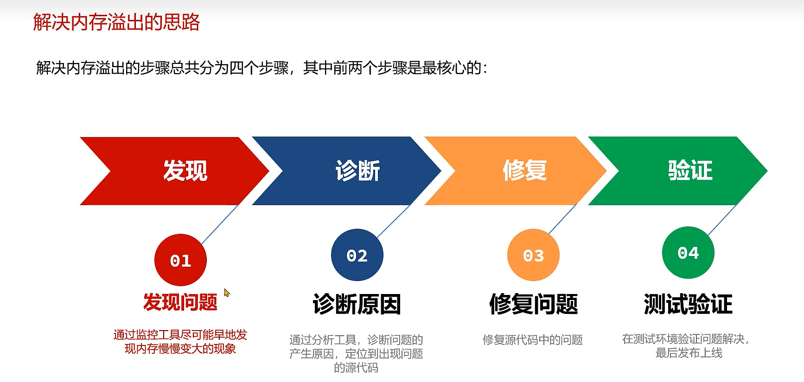


# 二、解决内存泄漏-监控-top命令


load average: 平均负载（Load Average）是一段时间内系统的平均负载，这个一段时间一般取1分钟、5分钟、15分钟。

top命令展示的数据默认是按照CPU占有大小排列的，如果要使用mem内存排序，则在输入top命令后，按键盘按下大写字母 "M"


top命令只能查看最基础的进程信息，所以只适合做初步筛查


# 三、解决内存泄漏-监控-visualvm


启动方式：

1.命令行模式下输入 jvisualvm

2.JDK安装目录下找到jvsualvm.exe，双击打开

3.IDEA中安装visualvm相关插件


也可以在IDEA中安装visualvm启动插件


插件安装完成后，需要手动指定目录


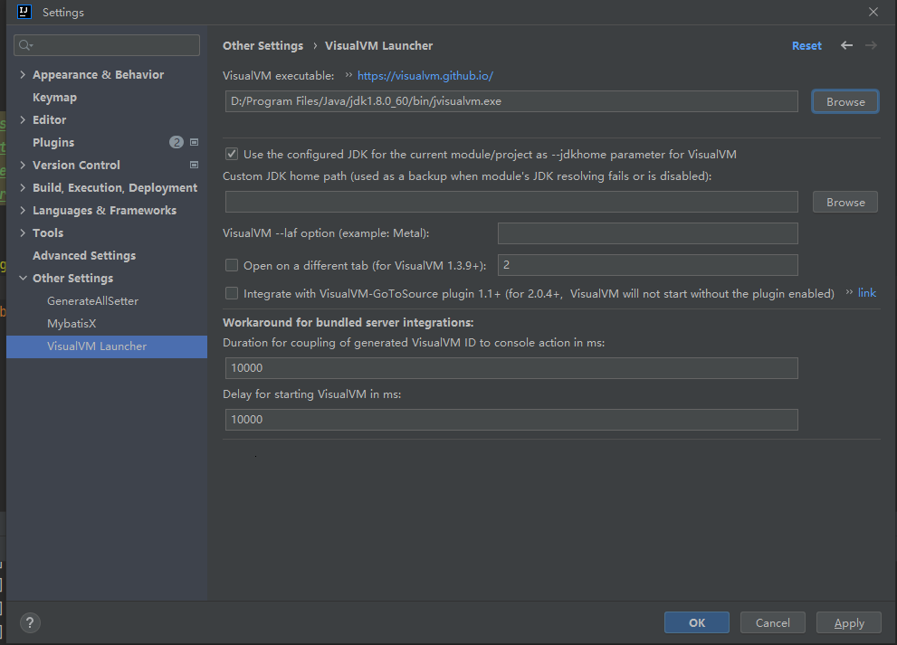

此时IDEA界面上就会出现visualvm相关的按钮


jvisualvm也可以监控远程服务器

启动java程序需要增加一些参数


**注意：生产环境中不要使用这中方式**，测试环境可以使用这种方式来查看问题


# 四、解决内存泄漏-监控-Arthas


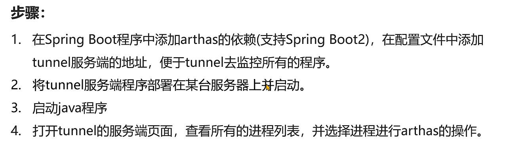

```
        <dependency>
            <groupId>com.taobao.arthas</groupId>
            <artifactId>arthas-spring-boot-starter</artifactId>
            <version>3.7.1</version>
        </dependency>
```


```
arthas:
  #tunnel地址，目前是部署在同一台服务器，正式环境需要拆分
  tunnel-server: ws://localhost:7777/ws
  #tunnel显示的应用名称，直接使用应用名
  app-name: ${spring.application.name}
  #arthas http访问的端口和远程连接的端口
  http-port: 8888
  telnet-port: 9999
```

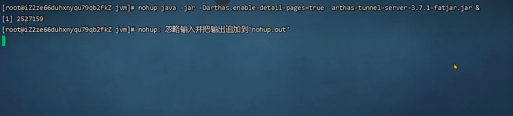

tunnel页面管理默认使用的端口号是8080

启动两个Java程序，注意端口号


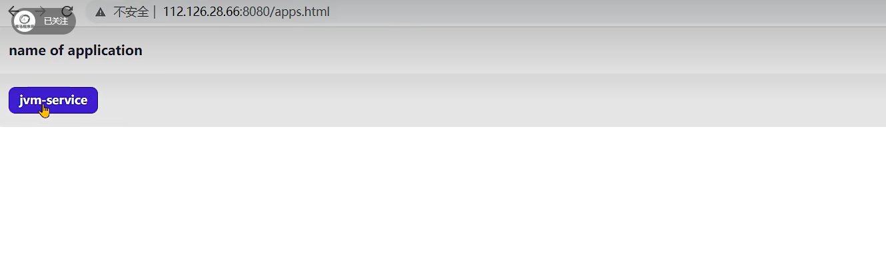


# 五、解决内存泄漏-监控-Prometheus+ Grafana


```
  <dependency>
            <groupId>org.springframework.boot</groupId>
            <artifactId>spring-boot-starter-actuator</artifactId>

            <exclusions><!-- 去掉springboot默认配置 -->
                <exclusion>
                    <groupId>org.springframework.boot</groupId>
                    <artifactId>spring-boot-starter-logging</artifactId>
                </exclusion>
            </exclusions>
        </dependency>
```


```
management:
	endpoints:
    	web:
      		exposure:
        	include: '*' #开放所有端口
```


```
        <dependency>
            <groupId>io.micrometer</groupId>
            <artifactId>micrometer-registry-prometheus</artifactId>
            <scope>runtime</scope>
        </dependency>
```

```
management:
  endpoint:
    metrics:
      enabled: true #支持metrics
    prometheus:
      enabled: true #支持Prometheus
  metrics:
    export:
      prometheus:
        enabled: true
    tags:
      application: jvm-test #实例名采集
```


# 六、解决内存泄漏-堆内存状况对比


# 七、内存泄漏产生的几大原因（代码问题）

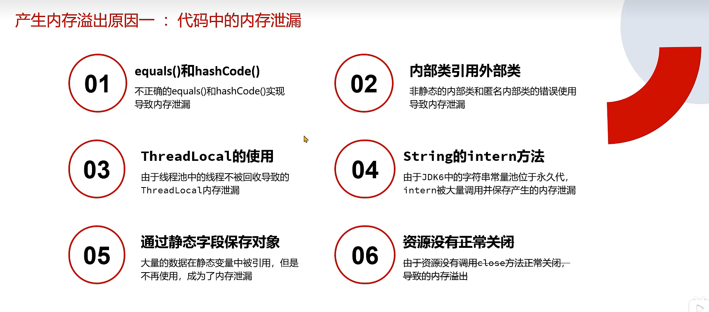

## 1、equals和hashCode导致的内存泄漏

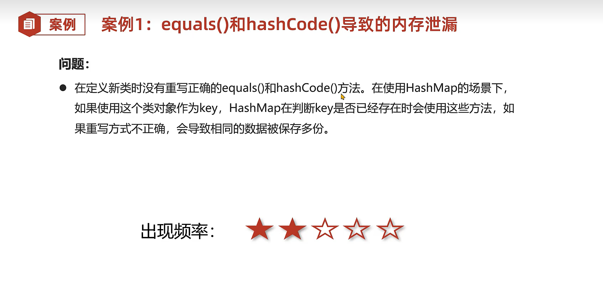

```
public class Demo2 {
    public static long count = 0;
    public static Map<Student,Long> map = new HashMap<>();
    public static void main(String[] args) throws InterruptedException {
        while (true){
            if(count++ % 100 == 0){
                Thread.sleep(10);
            }
            Student student = new Student();
            student.setId(1);
            student.setName("张三");
            map.put(student,1L);
        }
    }
}

```

```
public class Student {
    private String name;
    private Integer id;
    private byte[] bytes = new byte[1024 * 1024];

    public String getName() {
        return name;
    }

    public void setName(String name) {
        this.name = name;
    }

    public Integer getId() {
        return id;
    }

    public void setId(Integer id) {
        this.id = id;
    }
 }
```


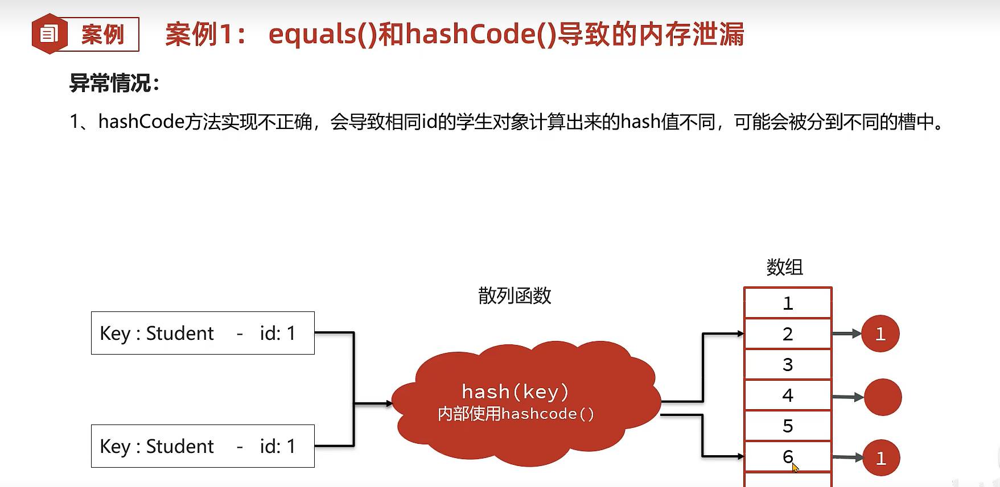


```
public class Student {
    private String name;
    private Integer id;
    private byte[] bytes = new byte[1024 * 1024];

    public String getName() {
        return name;
    }

    public void setName(String name) {
        this.name = name;
    }

    public Integer getId() {
        return id;
    }

    public void setId(Integer id) {
        this.id = id;
    }

    @Override
    public boolean equals(Object o) {
        if (this == o) {
            return true;
        }

        if (o == null || getClass() != o.getClass()) {
            return false;
        }

        Student student = (Student) o;

        return new EqualsBuilder().append(id, student.id).isEquals();
    }

    @Override
    public int hashCode() {
        return new HashCodeBuilder(17, 37).append(id).toHashCode();
    }
}
```


## 2、内部类引用外部类


```
public class Outer{
    private byte[] bytes = new byte[1024]; //外部类持有数据
    private String name  = "测试";
    class Inner{
        private String name;
        public Inner() {
            this.name = Outer.this.name;
        }
    }

    public static void main(String[] args) throws IOException, InterruptedException {
//        System.in.read();
        int count = 0;
        ArrayList<Inner> inners = new ArrayList<>();
        while (true){
            if(count++ % 100 == 0){
                Thread.sleep(10);
            }
            inners.add(new Outer().new Inner());
        }
    }
}
```

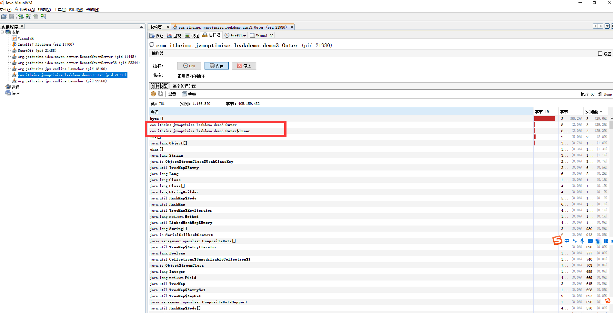

可以看到外部类一直无法被回收

解决方案，内部类改为static

```
public class Outer{
    private byte[] bytes = new byte[1024 * 1024]; //外部类持有数据
    private static String name  = "测试";
    static class Inner{
        private String name;
        public Inner() {
            this.name = Outer.name;
        }
    }

    public static void main(String[] args) throws IOException, InterruptedException {
//        System.in.read();
        int count = 0;
        ArrayList<Inner> inners = new ArrayList<>();
        while (true){
            if(count++ % 100 == 0){
                Thread.sleep(10);
            }
            inners.add(new Inner());
        }
    }
}
```


## 3、ThreadLocal的使用


示例，使用如下代码是没有问题的

```
public class Demo5_1 {
    public static ThreadLocal<Object> threadLocal = new ThreadLocal<>();

    public static void main(String[] args) throws InterruptedException {
        while (true) {
            new Thread(() -> {
                threadLocal.set(new byte[1024 * 1024 * 10]);
            }).start();
            Thread.sleep(10);
        }


    }
}
```

使用线程池的案例

```
public class Demo5 {
    public static ThreadLocal<Object> threadLocal = new ThreadLocal<>();

    public static void main(String[] args) throws InterruptedException {
        ThreadPoolExecutor threadPoolExecutor = new ThreadPoolExecutor(Integer.MAX_VALUE, Integer.MAX_VALUE,
                0, TimeUnit.DAYS, new SynchronousQueue<>());
        int count = 0;
        while (true) {
            System.out.println(++count);
            threadPoolExecutor.execute(() -> {
                threadLocal.set(new byte[1024 * 1024]);
//                threadLocal.remove();
            });
            Thread.sleep(10);
        }


    }
}
```

运行一段时间后，会出现内存溢出，解决方案 threadLocal.remove();


## 4、String的intern方法


## 5、通过静态字段保存对象


```
@Lazy //懒加载
@Component
public class TestLazy {
    private byte[] bytes = new byte[1024 * 1024 * 1024];
}
```

如果设置jvm内存大小为500M，没有使用懒加载的话，则程序无法启动。使用@Lazy后，程序可以正常启动，因为当前对象并没有被使用到，就不会被创建


## 6、资源没有正常关闭


# 八、产生内存溢出原因-并发请求问题


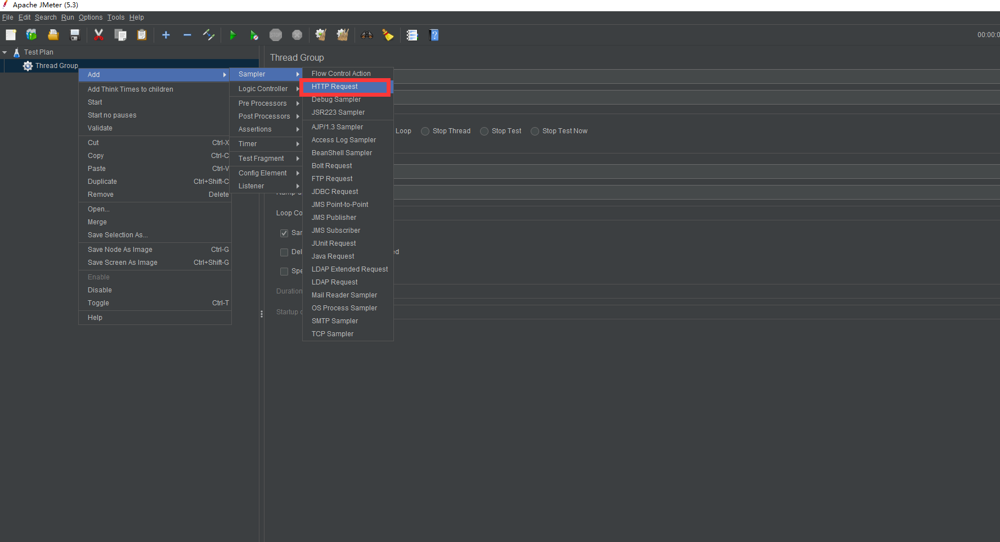

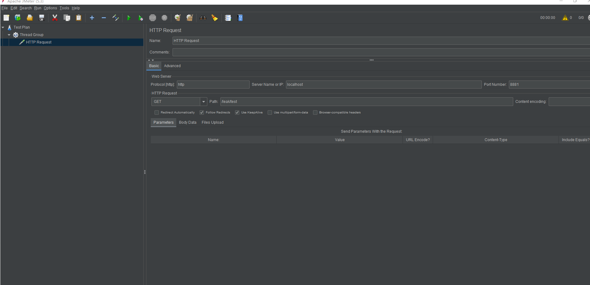


```java
    /**
     * 大量数据 + 处理慢
     */
    @GetMapping("/test")
    public void test1() throws InterruptedException {
        byte[] bytes = new byte[1024 * 1024 * 100];//100m
        Thread.sleep(10 * 1000L);
    }
```


```
    /**
     * 登录接口 传递名字和id,放入hashmap中
     */
    @PostMapping("/login")
    public void login(String name,Long id){
        userCache.put(id,new UserEntity(id,name));
    }
```


# 九、诊断（mat工具）

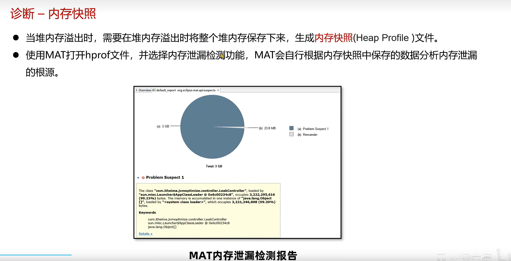


```
-XX:+HeapDumpOnOutOfMemoryError 

-XX:HeapDumpPath=D:\jvm\dump\jvm2.hprof
```


打开mat工具，选择dump文件

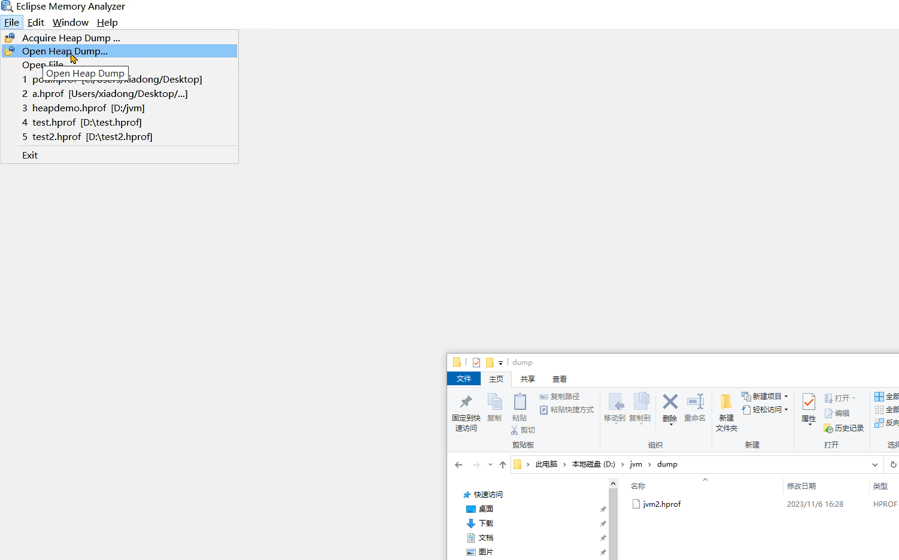

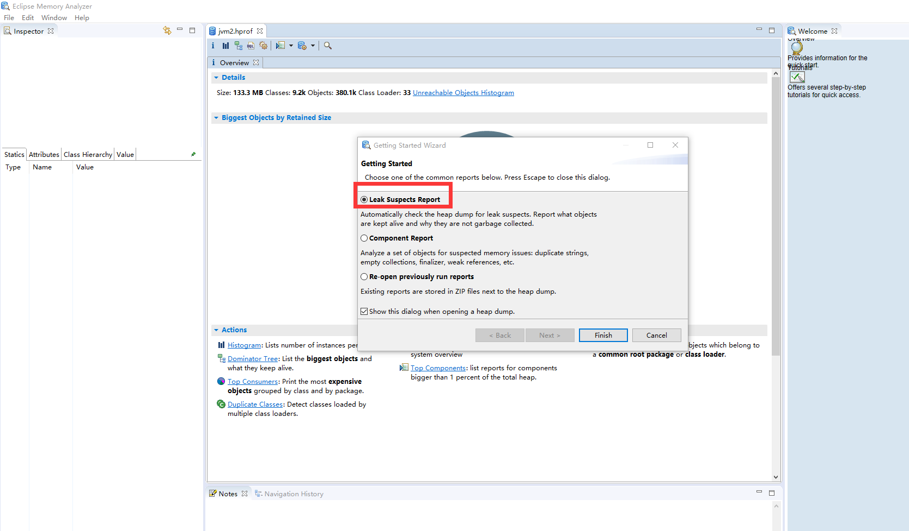


```
//-XX:+HeapDumpBeforeFullGC -XX:HeapDumpPath=D:/jvm/dump/mattest.hprof
public class HeapDemo {
    public static void main(String[] args) {
        TestClass a1 = new TestClass();
        TestClass a2 = new TestClass();
        TestClass a3 = new TestClass();
        String s1 = "itheima1";
        String s2 = "itheima2";
        String s3 = "itheima3";

        a1.list.add(s1);

        a2.list.add(s1);
        a2.list.add(s2);

        a3.list.add(s3);

        //System.out.print(ClassLayout.parseClass(TestClass.class).toPrintable());
        s1 = null;
        s2 = null;
        s3 = null;
        System.gc();
    }
}

class TestClass {
    public List<String> list = new ArrayList<>(10);
}
```

分析代码中的支配树


执行代码，生成mattest.hprof文件，打开mat工具分析


搜索main线程，发现工具上展示的和我们分析的支配树一样


# 十、导出运行中系统（还未溢出）的内存快照进行分析


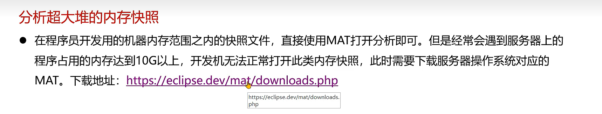

服务器上执行完命令后，会生成下面三个报告文件


下载解压第一份内存报告


打开Index.html页面，展示的内容和mat上看到的一样


# 十一、修复内容


## 1、查询大数据量导致的内存溢出


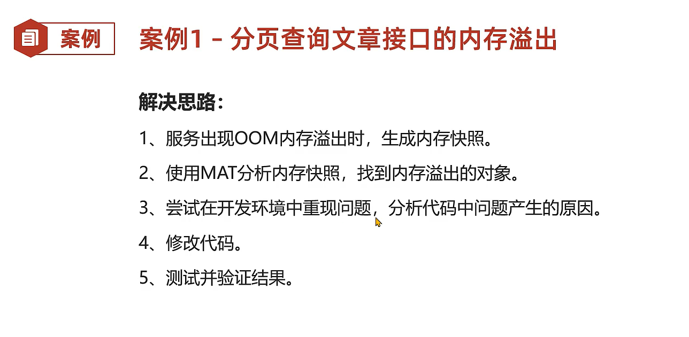


## 2、mybatis导致的内存溢出


分析hprof文件，查看直方图，按大小排序，发现前几个占用的大小比后面的高出很多


发现是tomcat线程，找到支配树，找到HandlerMethod方法，查看引用


## 3、导出大文件内存溢出


​	

``` java
@RestController
@RequestMapping("/excel")
public class Demo2ExcelController {

    @GetMapping("/export")
    public void export(int size, String path) throws IOException {
        // 1 、创建工作薄
        Workbook workbook = new XSSFWorkbook();
        // 2、在工作薄中创建sheet
        Sheet sheet = workbook.createSheet("测试");

        for (int i = 0; i < size; i++) {
            // 3、在sheet中创建行
            Row row0 = sheet.createRow(i);
            // 4、创建单元格并存入数据
            row0.createCell(0).setCellValue(RandomStringUtils.randomAlphabetic(1000));
        }


        // 将文件输出到指定文件
        FileOutputStream fileOutputStream = null;
        try {
            fileOutputStream = new FileOutputStream(path + RandomStringUtils.randomAlphabetic(10) + ".xlsx");
            workbook.write(fileOutputStream);
        } catch (Exception e) {
            e.printStackTrace();
        } finally {
            if (fileOutputStream != null) {
                fileOutputStream.close();
            }
            if (workbook != null) {
                workbook.close();
            }
        }

    }


    //http://www.hutool.cn/docs/#/poi/Excel%E5%A4%A7%E6%95%B0%E6%8D%AE%E7%94%9F%E6%88%90-BigExcelWriter
    @GetMapping("/export_hutool")
    public void export_hutool(int size, String path) throws IOException {


        List<List<?>> rows = new ArrayList<>();
        for (int i = 0; i < size; i++) {
           rows.add( CollUtil.newArrayList(RandomStringUtils.randomAlphabetic(1000)));
        }

        BigExcelWriter writer= ExcelUtil.getBigWriter(path + RandomStringUtils.randomAlphabetic(10) + ".xlsx");
// 一次性写出内容，使用默认样式
        writer.write(rows);
// 关闭writer，释放内存
        writer.close();


    }


    //https://easyexcel.opensource.alibaba.com/docs/current/quickstart/write#%E9%87%8D%E5%A4%8D%E5%A4%9A%E6%AC%A1%E5%86%99%E5%85%A5%E5%86%99%E5%88%B0%E5%8D%95%E4%B8%AA%E6%88%96%E8%80%85%E5%A4%9A%E4%B8%AAsheet
    @GetMapping("/export_easyexcel")
    public void export_easyexcel(int size, String path,int batch) throws IOException {

        // 方法1: 如果写到同一个sheet
        String fileName = path + RandomStringUtils.randomAlphabetic(10) + ".xlsx";
        // 这里注意 如果同一个sheet只要创建一次
        WriteSheet writeSheet = EasyExcel.writerSheet("测试").build();
        // 这里 需要指定写用哪个class去写
        try (ExcelWriter excelWriter = EasyExcel.write(fileName, DemoData.class).build()) {
            // 分100次写入
            for (int i = 0; i < batch; i++) {
                // 分页去数据库查询数据 这里可以去数据库查询每一页的数据
                List<DemoData> datas = new ArrayList<>();
                for (int j = 0; j < size / batch; j++) {
                    DemoData demoData = new DemoData();
                    demoData.setString(RandomStringUtils.randomAlphabetic(1000));
                    datas.add(demoData);
                }
                excelWriter.write(datas, writeSheet);
                //写入之后datas数据就可以释放了
            }
        }

    }
}
```


使用easy excel 分批导出


## 4、ThreadLocal内存泄漏


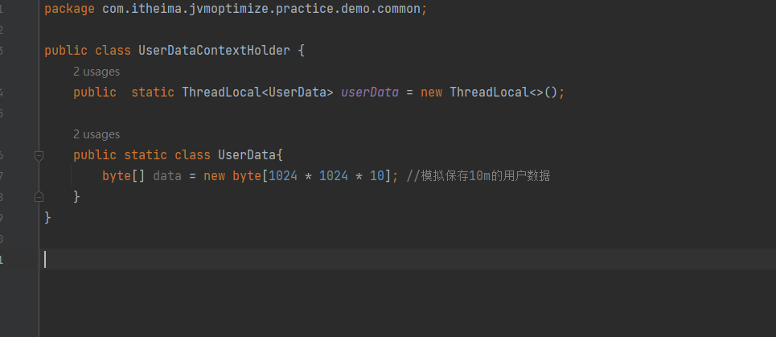


接口中error抛出异常，就不会执行到拦截器的postHandle方法

正确的做法是把  UserDataContextHolder.userData.remove(); 代码放到 afterCompletion中


正常情况下，tomcat线程使用完，就会进行回收，从而线程中包含的数据也会被回收。

但是当前案例中，我们对tomcat进行了设置，最大线程数500，核心线程数100，核心线程不会被回收。而我们jmeter设置了30个线程运行，所以这30个线程都不会被回收


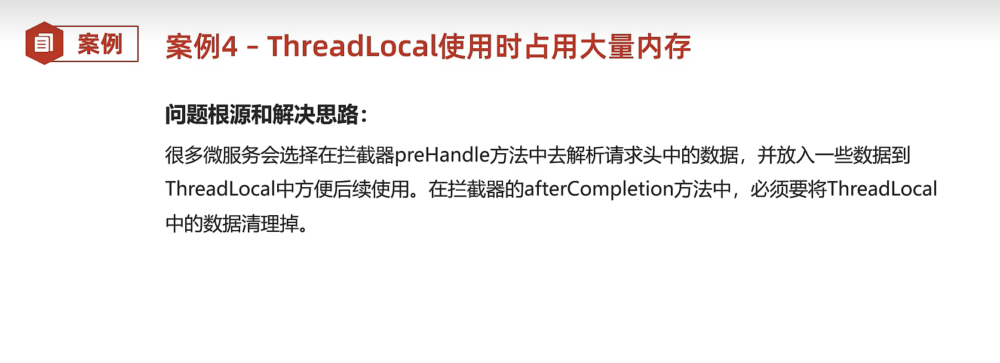

## 5、文章内容审核接口的内存溢出


```java
    @Autowired
    private ArticleService articleService;

    @PostMapping("/demo1/{id}")
    public void article1(@PathVariable("id") long id, @RequestBody ArticleDto article){
        article.setId(id);
        articleService.asyncSaveArticle(article);
    }
```


```java
    @Override
    @Async("asyncTaskExecutor")
    public void asyncSaveArticle(ArticleDto article) {
        aliyunUtil.verify(article.getTitle() + "。" + article.getContent());
    }
```


```java
@Component
public class AliyunUtil {

    //阿里云审核接口调用
    public void verify(String content){
        try {
            /**
             *  调用第三方接口审核数据，但是此时网络出现问题，
             * 第三方接口长时间没有响应，此处使用休眠来模拟30秒
             */
            Thread.sleep(30 * 1000);
        } catch (InterruptedException e) {
            e.printStackTrace();
        }
    }
}
```


```java
@Configuration
@EnableAsync
public class AsyncThreadPoolTaskConfig {

    private static final int corePoolSize = 50;       		// 核心线程数（默认线程数）
    private static final int maxPoolSize = 100;			    // 最大线程数
    private static final int keepAliveTime = 10;			// 允许线程空闲时间（单位：默认为秒）
    private static final int queueCapacity = 200;			// 缓冲队列数
    private static final String threadNamePrefix = "Async-Task-"; // 线程池名前缀
 
    @Bean("asyncTaskExecutor")
    public ThreadPoolTaskExecutor getAsyncExecutor(){
        ThreadPoolTaskExecutor executor = new ThreadPoolTaskExecutor();
        executor.setCorePoolSize(corePoolSize);
        //executor.setMaxPoolSize(Integer.MAX_VALUE);
        executor.setMaxPoolSize(maxPoolSize);
        executor.setQueueCapacity(queueCapacity);
        executor.setKeepAliveSeconds(keepAliveTime);
        executor.setThreadNamePrefix(threadNamePrefix);
        // 线程池对拒绝任务的处理策略
        executor.setRejectedExecutionHandler(new ThreadPoolExecutor.AbortPolicy());
        // 初始化
        executor.initialize();
        return executor;
    }
}
```


# 十二、btrace和arthas在线定位问题


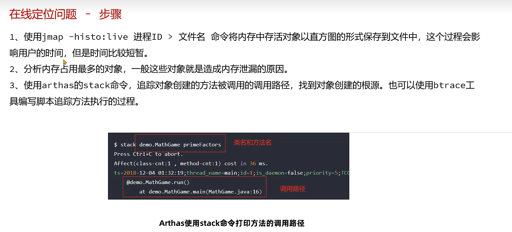


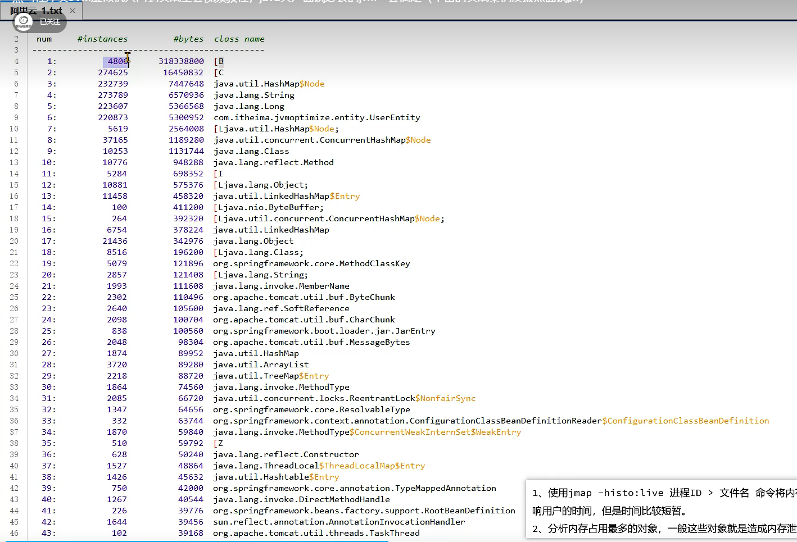


然后jmeter调用接口，云服务器控制台就会出现UserEntity的方法


stack命令比较简单，如果要追踪比较复杂的问题，比如追踪的时候要打印参数等内容，就可以用btrace


```
    <dependencies>
        <dependency>
            <groupId>org.openjdk.btrace</groupId>
            <artifactId>btrace-agent</artifactId>
            <version>${btrace.version}</version>
            <scope>system</scope>
            <systemPath>D:\tools\btrace-v2.2.4-bin\libs\btrace-agent.jar</systemPath>
        </dependency>

        <dependency>
            <groupId>org.openjdk.btrace</groupId>
            <artifactId>btrace-boot</artifactId>
            <version>${btrace.version}</version>
            <scope>system</scope>
            <systemPath>D:\tools\btrace-v2.2.4-bin\libs\btrace-boot.jar</systemPath>
        </dependency>

        <dependency>
            <groupId>org.openjdk.btrace</groupId>
            <artifactId>btrace-client</artifactId>
            <version>${btrace.version}</version>
            <scope>system</scope>
            <systemPath>D:\tools\btrace-v2.2.4-bin\libs\btrace-client.jar</systemPath>
        </dependency>
    </dependencies>
```


```java
@BTrace
public class TracingUserEntity {
        @OnMethod(
            clazz="com.itheima.jvmoptimize.entity.UserEntity",
            method="/.*/")
        public static void traceExecute(){
                jstack();
        }
}
```


# 十三、总结


